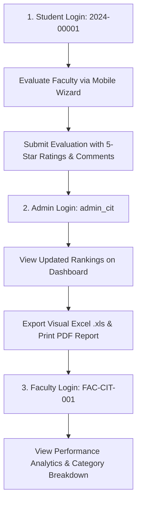

# Granby Colleges of Science and Technology
## Faculty Performance Evaluation System — Official Demo Accounts & Presentation Guide

> **Universal Demonstration Password:** `Admin@1234`  
> **System URL:** `http://localhost/fac-eval`

---

## 1. Quick Access Credentials Summary

| Role | Name / Description | Username / ID | Email | Password |
|---|---|---|---|---|
| **Superadmin** | Super Administrator | `superadmin` | `superadmin@granby.edu.ph` | `Admin@1234` |
| **Department Admin** | CIT Department Admin | `admin_cit` | `admin.cit@granby.edu.ph` | `Admin@1234` |
| **Student (Demo Evaluator)** | Dela Cruz, Juan M. (BSIT-2A) | `2024-00001` | `juan.delacruz.student@granby.edu.ph` | `Admin@1234` |
| **Faculty #1 (Rank #1)** | Dr. Maria Santos | `FAC-CIT-001` | `maria.santos@granby.edu.ph` | `Admin@1234` |
| **Faculty #2 (Rank #2)** | Prof. Juan Dela Cruz | `FAC-CIT-002` | `juan.delacruz@granby.edu.ph` | `Admin@1234` |
| **Faculty #3 (Rank #3)** | Engr. Roberto Garcia | `FAC-CIT-003` | `roberto.garcia@granby.edu.ph` | `Admin@1234` |
| **Faculty #4 (Rank #4)** | Ms. Elena Ramos | `FAC-CIT-004` | `elena.ramos@granby.edu.ph` | `Admin@1234` |
| **Faculty #5 (Below Min)** | Mr. David Tan | `FAC-CIT-005` | `david.tan@granby.edu.ph` | `Admin@1234` |

---

## 2. Detailed Account Information & Demonstration Workflows

### 🎓 A. Student Account (Mobile Wizard & Live Evaluation)
* **Login Identifier:** `2024-00001` *(Accepts Student No or Email)*
* **Password:** `Admin@1234`
* **Student Name:** `Dela Cruz, Juan M.`
* **Course & Section:** `BSIT - 2A`
* **Current Status:** **5 Pending Faculty Evaluations** loaded and ready for live demonstration:
  1. `CC103` — Web Systems & Technologies (Dr. Maria Santos)
  2. `CC102` — Data Structures & Algorithms (Prof. Juan Dela Cruz)
  3. `CC104` — Database Management Systems (Prof. Juan Dela Cruz)
  4. `CC105` — Object Oriented Programming (Engr. Roberto Garcia)
  5. `GE102` — Purposive Communication (Ms. Elena Ramos)

#### 🎯 Demo Presentation Highlights for Student:
1. **Responsive Mobile Evaluation Wizard:**
   - Touch-friendly 5-star rating interface with score descriptions.
   - Stepped category navigation with dynamic progress bar.
   - Mobile slide-out navigation drawer with prominent Logout button.
2. **Profanity Filter & Feedback:**
   - Real-time client and server-side profanity filtering on open-ended feedback comments.
3. **Notification Alerts:**
   - Live notification badge reminding student of pending evaluation deadlines.

---

### 🏛️ B. Department Administrator Account (CIT Department)
* **Login Identifier:** `admin_cit` *(or `admin.cit@granby.edu.ph`)*
* **Password:** `Admin@1234`
* **Department:** College of Information Technology (CIT)

#### 🎯 Demo Presentation Highlights for Admin:
1. **Executive Dashboard (`admin/dashboard.php`):**
   - Live **Faculty Rankings & Standings** with Gold medals (`🥇 #1`), qualitative rating badges, and respondent counts.
   - Active period selector and instant threshold filter (Min 1, 3, 5, or 10 respondents).
2. **Reports & Datasets Center (`admin/reports.php`):**
   - **🏆 Faculty Rankings Output Tab:** Formatted table with live search filter.
   - **📊 Detailed Criteria Matrix Tab:** Dynamic category columns showing percentage weights (e.g. *Teaching Effectiveness 40%*).
   - **🖨️ Presentation PDF Export:** Official Granby Colleges letterhead and 3-tier signature block (Evaluator, Dean, VPAA).
   - **📗 Visual Styled Excel Export (`.xls`):** Formatted spreadsheets with colors, medals, and score highlights.
3. **Enrollment & Subject Limits (`admin/enrollment.php`):**
   - Automated enforcement of **Max 8 subjects / Max 24 units** limit on regular bulk and irregular enrollments.
4. **Account Security (`admin/students.php` & `admin/faculty.php`):**
   - Secure "Reset Password" modal with zero plaintext password exposure.
5. **QR Code Registration (`admin/qr_codes.php` & `admin/registrations.php`):**
   - Token-based QR generation and review of pending registration requests.

---

### 🛡️ C. Super Administrator Account
* **Login Identifier:** `superadmin` *(or `superadmin@granby.edu.ph`)*
* **Password:** `Admin@1234`

#### 🎯 Demo Presentation Highlights for Superadmin:
1. **Institutional Governance:** Department creation, Admin assignments, and academic structure.
2. **Academic Terms:** Managing Academic Years (`2025-2026`) and active semesters.
3. **System Settings & Audit Logs:** Global configurations and system maintenance.

---

### 👨‍🏫 D. Faculty Member Accounts (Performance Analytics)

| Rank & Rating | Faculty Name | Employee ID | Specialization | Description |
|:---:|---|---|---|---|
| 🥇 **#1 Rank (4.92)** | **Dr. Maria Santos** | `FAC-CIT-001` | Web & Database Systems | Top performer, Outstanding rating |
| 🥈 **#2 Rank (4.45)** | **Prof. Juan Dela Cruz** | `FAC-CIT-002` | Algorithms & Programming | Very Satisfactory rating |
| 🥉 **#3 Rank (4.10)** | **Engr. Roberto Garcia** | `FAC-CIT-003` | Networks & Security | Very Satisfactory rating |
| **#4 Rank (3.35)** | **Ms. Elena Ramos** | `FAC-CIT-004` | General Education | Satisfactory rating |
| ⏳ **Pending Threshold** | **Mr. David Tan** | `FAC-CIT-005` | Emerging Tech | 1 respondent (tests `< 5` threshold) |

#### 🎯 Demo Presentation Highlights for Faculty:
1. **Faculty Dashboard & Analytics (`faculty/dashboard.php` & `faculty/performance.php`):**
   - View overall score and category breakdown radar/bar charts.
   - Review anonymized student comments and qualitative feedback.
   - View assigned subjects and class sections.

---

## 3. Recommended Live Presentation Flow

1. **Step 1 — Student Evaluation Experience:**
   - Log in as `2024-00001` / `Admin@1234`.
   - Open **Evaluate Faculty** and complete a subject evaluation using the mobile wizard.
2. **Step 2 — Admin Results & Reporting:**
   - Log in as `admin_cit` / `Admin@1234`.
   - View the live standings on **Dashboard** and download the **Executive Excel (.xls)** or **Presentation PDF** from **Reports**.
3. **Step 3 — Faculty Performance Review:**
   - Log in as `FAC-CIT-001` / `Admin@1234`.
   - Open **Performance** to review score breakdowns and student feedback.
